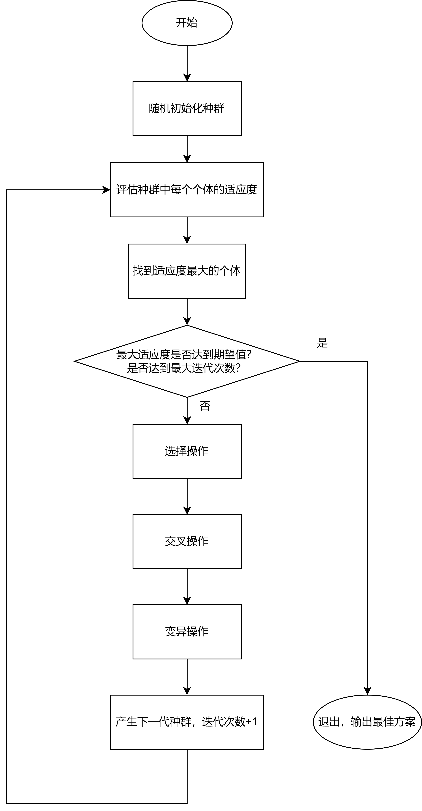
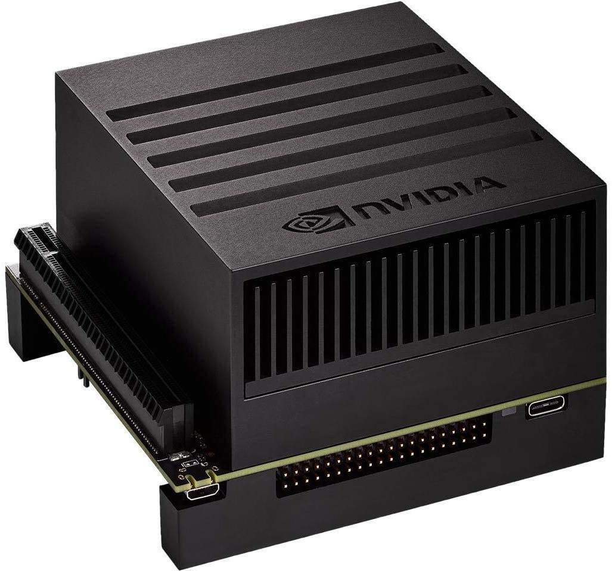
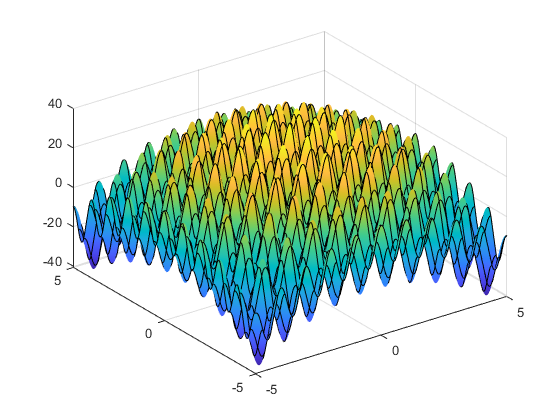

##  基于CUDA平台的并行遗传算法实现

### 算法流程



#### 选择操作

为了便于并行运算，提高计算速度，选择操作使用竞标赛选择法而非轮盘赌选择法，这样无需对种群中的个体按适应度大小进行排序，只须找出种群中适应度最大的个体。具体操作方法为随机选择父代中的两个个体，以较大概率选择其中适应度较大的个体作为子代。

#### 寻找最优个体

利用CUDA多线程并发的优势，多个线程同时比较，得到局部最优值向量，最终由一个线程从局部最优值向量中得到全局最优的个体，利用共享内存进行线程块内的通信，优化读取速度。

#### 交叉和变异操作

交叉和变异操作需要根据具体问题定义，编码方式不同，交叉和变异的操作也不尽相同，但是选择操作都是一致的。

### 软硬件平台

#### 硬件平台

本实验的硬件平台为英伟达推出的AI计算平台Jetson AGX Xavier，广泛应用于边缘计算与机器人领域。

由于Jetson AGX Xavier的CPU和GPU集成在同一Soc上，CPU与GPU共用同一块内存，因此使用CUDA的统一内存技术，无需进行CPU与GPU的内存交换，大大降低通信开销。



| 模块           | 参数                                                         |
| -------------- | ------------------------------------------------------------ |
| GPU            | 512核 Volta GPU with 64 Tensor Cores 11 TFLOPS (FP16) 22 TOPS (INT8) |
| CPU            | 8核 ARM v8.2 64 位 CPU，8MB L2缓存 + 4MB L3缓存              |
| 内存           | 32GB 256 位 LPDDR4x                                          |
| 深度学习加速器 | (2x) NVDLA Engines* \| 5 TFLOPS (FP16), 10 TOPS (INT8)       |

#### 软件平台

操作系统：Ubuntu 18.04LTS

软件环境：cuda-toolkits 10.2版本，cuRAND随机数生成库

- nvcc编译器

  编译指令: 

  ```sh
  $ nvcc -o 可执行文件名 -g -G 源文件名.cu
  #Ctrl+D退出-g -G 代表为CPU和GPU代码部分进行调试编译
  ```

- cuda-gdb调试工具

  ```sh
  $ cuda-gdb ./可执行文件
  $ run #运行代码
  ```

  cuda-gdb是一个魔改版的gdb，能同时捕捉到CPU和GPU上的bug。

  ```sh
  $ sudo chmod a+rw /dev/nvhost-dbg-gpu
  ```

  解决`The CUDA driver initialization failed. (error code = CUDBG_ERROR_INITIALIZATION_FAILURE(0x14)`问题

- cuda-memcheck 内存检查调试工具

  ```sh
  $ cuda-memcheck ./可执行文件
  ```

##### CUDA C/C++

CUDA C/C++是原始C/C++语言的扩展，以适用于GPU编程。

###### 函数类型限定符

| 限定符       | 执行       | 调用                                            |
| ------------ | ---------- | ----------------------------------------------- |
| `__global__` | 设备端执行 | 可从主机端调用，也可从计算能力大于3的设备中调用 |
| `__device_`  | 设备端执行 | 仅设备端调用                                    |
| `__host__`   | 主机端执行 | 仅主机端调用                                    |

`__host__`和`__device__`限定符可一起使用，这样函数可以同时再主机和设备端进行编译。

- `__global__`函数参数通过constant memory被传递到device，and are limited to 4 KB.
- `__global__` 函数不能使用变长度参数
- `__global__` 函数不能传递引用
- `__global__` 函数不支持递归调用

`__global__`核函数调用方式，在CPU代码中调用，运行在GPU上。

```c++
kernel_name<<<grid,block>>>(argument list);
```

- grid是网格维数，即启动线程块的数目结构
- block是块维度，即每个线程块中线程的数目结构

此核函数一次调用了grid*block个GPU线程。

##### cuRAND随机数生成库

cuRAND是英伟达专为其GPU推出的随机数生成库，利用GPU并发生成随机数，大大加快程序运行速度。

```c++
__device__ void curand_init(unsigned long long seed, unsigned long long sequence,unsigned long long offset, curandState_t *state);
__device__ unsigned int curand (curandState_t *state);
__device__ float curand_uniform(curandState_t *state);
```

在调用`curand_init()`后，`curand()`返回一系列伪随机数。如果state相同，则`curand()`生成相同的随机数序列。`curand_init()`函数使用给定的种子、序列号和序列内的偏移量设置调用者分配的初始状态。不同的种子保证产生不同的起始状态和不同的序列。相同的种子总是产生相同的状态和相同的序列。

对于最高质量的并行伪随机数生成，每个实验都应该分配一个唯一的种子。在一个实验中，每个计算线程都应该分配一个唯一的序列号。

`curand_uniform()`函数用于生成一个$(0.0,1.0]$之间服从均匀分布float型随机数。

### 代码

本代码完全个人原创，基于CUDA异构计算平台，利用GPU的并行特性加速代码运行速度，并利用了C++的面向对象和泛型编程的特性，简化代码的同时扩大代码的适用性。

#### CUDA API错误诊断宏定义

```assembly
#define CHECK(call)                          \
do                                           \
{                                            \
    const cudaError_t error_code = call;     \
    if (error_code != cudaSuccess)           \
    {                                        \
        printf("CUDA Error:\n");             \
        printf(" File: %s\n", __FILE__);     \
        printf(" Line: %d\n", __LINE__);     \
        printf(" Error code: %d\n", error_code);\
        printf(" Error text: %s\n",      \
            cudaGetErrorString(error_code)); \
        exit(1); \
    }            \
} while (0)
```

用于诊断CUDA API的返回错误，显示错误发生的具体文件和行数，便于调试。

#### 染色体对象定义

一个染色体就代表一个个体，具有一个基因串，代表假设空间

```c++
template <typename T>
class Chromosome{//染色体模板类
public:
    //variables
    T* genes;//基因指针
    unsigned int lengthOfGenes;//基因个数
    float fitness;//适应度
    //functions
    __device__ void initial();//初始化函数
    __device__ void crossover(Chromosome<T>*);//交叉函数
    __device__ void mutation();//变异函数
    __host__ __device__ Chromosome(){//无参构造函数
        genes=NULL;
        lengthOfGenes=0;
        fitness=FLOAT_NEG_INF;
    }
    __host__  Chromosome(unsigned int length_gen){//构造函数
        lengthOfGenes=length_gen;
        cudaMallocManaged(&genes,sizeof(T)*lengthOfGenes);
        memset(genes,0,sizeof(T)*lengthOfGenes);
        fitness=FLOAT_NEG_INF;
    }
    __host__  Chromosome(Chromosome<T> &c){//复制构造函数
        lengthOfGenes=c.lengthOfGenes;
        cudaMallocManaged(&genes,sizeof(T)*lengthOfGenes);
        fitness=c.fitness;
        for(unsigned int i=0;i<lengthOfGenes;i++){
            genes[i]=c.genes[i];
        }
    }
    __host__  void setup(unsigned int length_gen)//初始化函数
    {
        lengthOfGenes=length_gen;
        cudaMallocManaged(&genes,sizeof(T)*lengthOfGenes);
        memset(genes,0,sizeof(T)*lengthOfGenes);
        fitness=FLOAT_NEG_INF;
    }
    __host__  ~Chromosome()//析构函数
    {
        cudaFree(this->genes);
    }
    __host__ __device__ void operator=(Chromosome<T> &c){
        if(this->lengthOfGenes==c.lengthOfGenes){
            this->fitness=c.fitness;
            for (int i = 0; i < this->lengthOfGenes; i++)
            {
                this->genes[i]=c.genes[i];
            }
        }
    }
};
```

#### 种群对象定义

```c++
template <typename T>
class Population{//种群模板类
public: 
    //variables
    Chromosome<T> **individuals;//种群个体
    Chromosome<T> **sons;//子代
    Chromosome<T> *maxFitnessIdv;//最大适应度个体
    unsigned int numOfIndiv;//种群个体数目
    unsigned int numOfGenes;//个体基因数
    float tournamentThre;//锦标赛选择的概率阈值
    float matRate;//交叉比例
    float mutRate;//变异比例
    //functions
    __host__ __device__ Population(){//无参构造函数
        numOfIndiv=0;
        numOfGenes=0;
        individuals =NULL;
        sons =NULL;
        tournamentThre=0;
        matRate=0;
        mutRate=0;
        maxFitnessIdv=NULL;
    }
    __host__ void setup(unsigned int numIndiv,unsigned int numGenes,float tourThre,float matrate,float mutrate){//初始化函数
        numOfIndiv=numIndiv;
        numOfGenes=numGenes;
        cudaMallocManaged(&individuals,sizeof(Chromosome<T>*)*numOfIndiv);
        cudaMallocManaged(&sons,sizeof(Chromosome<T>*)*numOfIndiv);
        cudaMallocManaged(&maxFitnessIdv,sizeof(Chromosome<T>));

        tournamentThre=tourThre;
        matRate=matrate;
        mutRate=mutrate;
        maxFitnessIdv->setup(numOfGenes);
        for(unsigned int i=0;i<numOfIndiv;i++)
        {
            cudaMallocManaged(&(individuals[i]),sizeof(Chromosome<T>));
            individuals[i]->setup(numOfGenes);
            cudaMallocManaged(&(sons[i]),sizeof(Chromosome<T>));
            sons[i]->setup(numOfGenes);
        }
    }

    __host__ ~Population(){//析构函数
        for(unsigned int i=0;i<this->numOfIndiv;i++)
        {
            cudaFree(this->individuals[i]);
        }
        cudaFree(this->individuals);
        cudaFree(this->sons);
        cudaFree(this->fitness);
    }    
    __device__ void initial(){
        unsigned int tid= blockIdx.x * blockDim.x + threadIdx.x;//线程编号 
        if(tid<this->numOfIndiv){
            this->individuals[tid]->initial();                            
        }
        __threadfence();//对于全局内存的读写同步
    }
    __device__ void evolution(){//演化，每个线程生成一个子代
        Chromosome<T>* p1;
        Chromosome<T>* p2;
        curandState_t state;
        unsigned int tid= blockIdx.x * blockDim.x + threadIdx.x;//线程编号
        curand_init(clock(),tid,0,&state);//初始化随机数生成器
        
        if(tid<(matRate*numOfIndiv)){//交叉
            p1=this->individuals[curand(&state)%this->numOfIndiv];//随机选
            p2=this->individuals[curand(&state)%this->numOfIndiv];//随机选
            if(p1->fitness>p2->fitness){
                *(this->sons[tid])=*p1;
            }
            else{
                *(this->sons[tid])=*p2;
            }
            p1=this->individuals[curand(&state)%this->numOfIndiv];//随机选
            p2=this->individuals[curand(&state)%this->numOfIndiv];//随机选
            if(p1->fitness>p2->fitness){
                this->sons[tid]->crossover(p1);
            }
            else{
                this->sons[tid]->crossover(p2);
            }
        }
        else if(tid<numOfIndiv){//选择
            p1=this->individuals[curand(&state)%this->numOfIndiv];//随机选
            p2=this->individuals[curand(&state)%this->numOfIndiv];//随机选
            if(p1->fitness>p2->fitness){
                if(curand_uniform(&state)<this->tournamentThre){
                    *(this->sons[tid])=*p1;
                }
                else{
                    *(this->sons[tid])=*p1;
                }
            }
            else{
                if(curand_uniform(&state)>this->tournamentThre){
                    *(this->sons[tid])=*p1;
                }
                else{
                    *(this->sons[tid])=*p1;
                }
            }
        }
        __threadfence();
        if(tid<this->numOfIndiv){
            if(curand_uniform(&state)<this->mutRate){//变异
                this->sons[tid]->mutation();
            }
            *(this->individuals[tid])=*(this->sons[tid]);
        }
        __threadfence();//对于全局内存的读写同步
    }
};
```

#### 寻找种群中最优个体函数

```c++
template<class T>//寻找当前种群最优个体，并更新历史最优
__global__ void find_best(Population<T> *p, float* max){
    __shared__ float mTop[BLOCK_SIZE];
    __shared__ unsigned int mIdx[BLOCK_SIZE];
    unsigned int tid=threadIdx.x + blockDim.x * blockIdx.x;
    float top = p->individuals[tid]->fitness;
    unsigned int topIdx=tid;
    for(unsigned int idx = tid; idx<p->numOfIndiv; idx+= gridDim.x*blockDim.x)
    {
        if(p->individuals[idx]->fitness>top)
        {
            top = p->individuals[idx]->fitness ;
            topIdx=idx;
        }
    }
    mTop[threadIdx.x]=top;
    mIdx[threadIdx.x]=topIdx;
    __syncthreads();//线程块内同步
    for (unsigned int i = BLOCK_SIZE / 2; i; i /=2 )
    {
        if(threadIdx.x < i)
        {
            if(mTop[threadIdx.x]<mTop[threadIdx.x+i])
            {
                mTop[threadIdx.x] = mTop[threadIdx.x+i];
                mIdx[threadIdx.x] = mIdx[threadIdx.x+i];
            }
        }
        __syncthreads();//线程块内同步
    }
    if(blockIdx.x*blockDim.x < p->numOfIndiv)
    {
        if(tid == 0)
        {
            if(p->maxFitnessIdv->fitness<mTop[0]){
                *(p->maxFitnessIdv)=*(p->individuals[mIdx[0]]);  
            }
            max[blockIdx.x] = mTop[0];
        }
    }
}
```

`__shared__`声明共享内存，共享内存是一个线程块共用的高速缓存，比全局内存要快很多。

##### CPU端调用遗传算法的程序接口API

```c++
template<class T>
__host__ void GA(Chromosome<T>*best,unsigned int numIndiv,unsigned int numGenes,float tourThreshold,float matrate,float mutrate,float fitnessThreshold,unsigned long maxIteration)
{  
    numIndiv=numIndiv/2*2;
    Population<T> *Pop;//指针声明
    float *devMax;//指针声明
    CHECK(cudaMallocManaged(&Pop, sizeof(Population<T>)));//申请设备内存
    Pop->setup(numIndiv,numGenes,tourThreshold,matrate,mutrate);
    CHECK(cudaMallocManaged(&devMax, sizeof(float)));//申请设备内存
    cudaEvent_t start, stop;//声明事件,用来记录时间
    CHECK(cudaEventCreate(&start));//事件创建
    CHECK(cudaEventCreate(&stop));//事件创建
    CHECK(cudaEventRecord(start));//记录开始的时间
    pop_init<T><<<(numIndiv+BLOCK_SIZE-1)/BLOCK_SIZE,BLOCK_SIZE>>>(Pop);//随机初始化种群
    CHECK(cudaDeviceSynchronize());//CPU与GPU同步
    pop_evaluate<T>(Pop,numIndiv);//评估整个种群每个个体的适应度
    CHECK(cudaDeviceSynchronize());//CPU与GPU同步
    find_best<T><<<1,BLOCK_SIZE>>>(Pop,devMax);//寻找最优个体
    CHECK(cudaDeviceSynchronize());//CPU与GPU同步
    for(unsigned int it=0;it<maxIteration && *devMax<fitnessThreshold;it++){
        pop_evolve<T><<<(numIndiv+BLOCK_SIZE-1)/BLOCK_SIZE,BLOCK_SIZE>>>(Pop);
        CHECK(cudaDeviceSynchronize());//CPU与GPU同步
        pop_evaluate<T>(Pop,numIndiv);//评估整个种群每个个体的适应度
        CHECK(cudaDeviceSynchronize());//CPU与GPU同步
        find_best<T><<<1,BLOCK_SIZE>>>(Pop,devMax);//寻找最优个体,如果是历史最优则更新
        CHECK(cudaDeviceSynchronize());//CPU与GPU同步
        printf("The max fitness of %uth generation is %f\n",it,*devMax);
    }
    //记录算法结束时间
    CHECK(cudaEventRecord(stop));
    CHECK(cudaEventSynchronize(stop));
    float elapsed_time;
    CHECK(cudaEventElapsedTime(&elapsed_time, start, stop));//记录算法消耗的时间
    printf("Genetic algorithm spends time of %f ms.\n", elapsed_time);
    *best=*(Pop->maxFitnessIdv);//将最优个体提取出来
    CHECK(cudaEventDestroy(start));//销毁事件
    CHECK(cudaEventDestroy(stop));//销毁事件
    CHECK(cudaFree(devMax));//释放设备内存
    CHECK(cudaFree(Pop));//释放设备内存
}
```

参数：

- best：函数返回的最优个体接收指针
- numIndiv：种群个体数量
- numGenes：每一个个体的染色体拥有的基因数量
- tourThreshold：锦标赛选择法的概率阈值
- matrate：交配比例
- mutrate：变异比例
- fitnessThreshold：适应度阈值，算法结束条件之一
- maxIteration：最大迭代次数，算法结束条件之二

### 实例1：求使目标函数最优值的参数值

#### 目标函数

$$
f(x_1,x_2)=20-x_1^2-x_2^2+10\cdot[{\rm{cos(2\pi x_1)}}+\rm{cos(2\pi x_2)}]
$$



​	可以看到目标函数有很多局部极值点，如果使用梯度下降等搜索算法，很容易陷入局部极值。

由函数图像大致看出目标函数全局最优值在零点附近，$f(0,0)=40.0$，全局最优值为40.0。

#### 遗传算法具体细节

- **编码方式**

​	定义一条染色体有两个float型的基因，分别代表$x_1$和$x_2$。

- **初始化**

  将每条染色体的基因初始化为-1000到1000之间的任意整数

  ```c
  template<>//特化染色体的初始化操作
  __device__ void Chromosome<float>::initial(){
      unsigned int tid= blockIdx.x * blockDim.x + threadIdx.x;//线程编号
      curandState_t state;
      curand_init(clock(),tid,0,&state);
      for(unsigned int i=0; i<this->lengthOfGenes;i++){
          this->genes[i]=(float)(curand(&state)%2000)-1000;
      }
  }
  ```
  
- **染色体交叉操作**

  将两条染色体的对应基因求平均得到子代

  ```c
  template<>//特化染色体的交叉操作
  __device__ void Chromosome<float>::crossover(Chromosome *c){
      for (unsigned int i = 0; i < this->lengthOfGenes; i++) {
          this->genes[i] = (this->genes[i] + c->genes[i]) / 2.0;//对应基因求平均得到子代
      }
  }
  ```

- **染色体变异操作**

  染色体的每一个基因加上一个(-50,50)区间内的浮点数
  ```c
  template<>//特化染色体的变异操作
  __device__ void Chromosome<float>::mutation(){
      unsigned int tid= blockIdx.x * blockDim.x + threadIdx.x;//线程编号
      curandState_t state;
      curand_init(clock(),tid,0,&state);//初始化随机数生成器
      for (unsigned int i = 0; i < this->lengthOfGenes; i++) {
          this->genes[i] = this->genes[i]+(curand_uniform(&state)-0.5)*100;//每个基因加上一个随机数
      }
  }
  ```

- **染色体的适应度函数**

  染色体的适应度函数即为目标函数值$f(x_1,x_2)=20-x_1^2-x_2^2+10\cdot[{\rm{cos(2\pi x_1)}}+\rm{cos(2\pi x_2)}]$
  ```c
  __global__ void get_fitness(Population<float>* p){
      unsigned int tid= blockIdx.x * blockDim.x + threadIdx.x;//线程编号
      if(tid<p->numOfIndiv){
           p->individuals[tid]->fitness=20-powf(p->individuals[tid]->genes[0],2)-powf(p-> individuals[tid]->genes[1],2)+10*(cosf(2*M_PI*p->individuals[tid]->genes[0])+cosf(2*M_PI*p-> individuals[tid]->genes[1]));
      }
  }
  ```

#### 实验结果

##### 参数设置：

- 种群个体数量：1024
- 锦标赛选择法概率阈值：0.8
- 交配比例：0.5
- 变异比例：0.5
- 适应度阈值：38.0
- 最大迭代次数：200

适当加大变异比例，增加染色体基因的随机性，扩大搜索范围。

##### 一次学习的输出结果：

```
hello!Genetic Algorithm begin!
The max fitness of 0th generation is -258.447937
The max fitness of 1th generation is -214.154358
The max fitness of 2th generation is -103.410202
The max fitness of 3th generation is -51.352238
The max fitness of 4th generation is 16.051048
The max fitness of 5th generation is -17.370497
The max fitness of 6th generation is 28.118034
The max fitness of 7th generation is 29.255676
The max fitness of 8th generation is 26.490776
The max fitness of 9th generation is 33.114395
The max fitness of 10th generation is 31.587978
The max fitness of 11th generation is 34.387192
The max fitness of 12th generation is 26.063128
The max fitness of 13th generation is 26.063128
The max fitness of 14th generation is 25.894630
The max fitness of 15th generation is 38.405693
Genetic algorithm spends time of 2411.363281 ms.
Best genes are  -1.035420 0.037356      MaxFitness=38.405693
```

##### 多次实验统计结果：

|实验批次|用时/ms|最优值|
|-|-|-|
|1|3460.622314| 39.526775|
|2|5061.610352 | 39.366932|
|3|2980.749268| 38.821945|
|4|4983.832520| 38.329094|
|5|11024.286133 |38.773621|
|6|5928.618164 |39.379669|
|7|6738.308105 |39.431053|
|8|9712.906250 |38.728863|
|9|6692.8906|38.599098|
|10|3619.6125|38.82592|
|11|6020.343628|38.978297|
|12|3904.558105	|38.982109|
|13|7559.537598|38.952019|
|14|7068.872559|38.982597|
|15|2308.97876|38.920906|
|16|985.000977|38.617508|
|17|2193.410889|38.230865|
|18|4468.395996|38.57032|
|19|2805.818359|38.427559|
|20|6897.199219|38.889111|
|平均| 5220.777619 |38.86671305|

​		根据实验结果，每次学习的平均时间在5s左右，学得的目标函数最优值平均值为38.8667，非常接近全局最优40.0。算法的速度和精度都很优异。

### 实例2：学习感知机模型根据身高体重预测性别

#### 训练数据

​		统计100名男(女)生的身高和体重，利用遗传算法学习一个感知机，依据一个人身高和体重判断此人的性别。将数据画成散点图可以看出数据并不是线性可分的。


| 性别(1:男,0:女) | 身高        | 体重        |
| --------------- | ----------- | ----------- |
| 1               | 171.5487975 | 60.21838701 |
| 0               | 162.9471637 | 54.3567427  |
| 1               | 168.9573047 | 56.79476735 |
| 0               | 156.2632499 | 40.38446824 |
| 0               | 157.4300811 | 41.77733535 |
| 0               | 158.2294602 | 39.1437104  |
| ......          | ......      | ......      |


#### 假设空间

假设空间为两个输入的感知机模型
$$
f(h,w)=o(\alpha_0+\alpha_1 h+\alpha_2 w)
$$

其中$h$为身高，$w$为体重，$o(x)=\begin{cases}1\quad {\rm if}\ x>0\\0\quad {\rm othervise}\end{cases}$ 为阈值函数

#### 遗传算法具体细节

- **编码方式**

​	定义一条染色体有三个float型的基因，分别代表参数向量$\alpha_1,\alpha_2$和$\alpha_3$。

- **初始化**

  将参数向量初始化为-1000到1000之间的任意整数

  ```c
  template<>//特化染色体的初始化操作
  __device__ void Chromosome<float>::initial(){
      unsigned int tid= blockIdx.x * blockDim.x + threadIdx.x;//线程编号
      curandState_t state;
      curand_init(clock(),tid,0,&state);
      for(unsigned int i=0; i<this->lengthOfGenes;i++){
          this->genes[i]=(float)(curand(&state)%2000)-1000;
      }
  }
  ```

- **染色体交叉操作**

  两条染色体交换一个基因

  ```c
  template<>//特化染色体的交叉操作
  __device__ void Chromosome<float>::crossover(Chromosome *c){
      this->genes[1] = c->genes[1];
  }
  ```

- **染色体变异操作**

  染色体的每一个基因加上一个(-5,5)区间内的浮点数

  ```c
  template<>//特化染色体的变异操作
  __device__ void Chromosome<float>::mutation(){
      unsigned int tid= blockIdx.x * blockDim.x + threadIdx.x;//线程编号
      curandState_t state;
      curand_init(clock(),tid,0,&state);//初始化随机数生成器
      for (unsigned int i = 0; i < this->lengthOfGenes; i++) {
          this->genes[i] = this->genes[i]+(curand_uniform(&state)-0.5)*10;
      }
  }
  ```

- **染色体的适应度函数**

  染色体的适应度函数为正则化的误差函数的相反数，$\gamma$取为0.01
  $$
  -E(\vec{\omega})=-\sum_{d\in D}(t_d-o_d)^2-\gamma\sum_{i=0}^2\alpha_i^2
  $$
  
  损失函数是越小越好，因此为了符合适应度函数越大越好的原则，对损失函数取相反数。

  ```c
  __global__ void get_fitness(Population<float>* p){//定义染色体的适应度函数
      unsigned int tid= blockIdx.x * blockDim.x + threadIdx.x;//线程编号
      float sum=0,temp=0;
      if(tid<p->numOfIndiv){
          for (unsigned int i = 0; i < DATASIZE;i++)
          {
              temp=p->individuals[tid]->genes[0]+ p->individuals[tid]->genes[1]*Dataset[i][1]+p->individuals[tid]->genes[2]*Dataset[i][2];
              if(temp>0) temp=1;
              else temp=0;
              sum-=powf(Dataset[i][0]-temp,2);
          }
          sum-=0.01*powf(p->individuals[tid]->genes[0],2)+0.01*powf(p->individuals[tid]->genes[1],2)+0.01*powf(p->individuals[tid]->genes[2],2);
          p->individuals[tid]->fitness=sum;
      }
  }
  ```

#### 实验结果

##### 参数设置：

- 种群个体数量：1024
- 锦标赛选择法概率阈值：0.8
- 交配比例：0.5
- 变异比例：0.5
- 适应度阈值：-18.0
- 最大迭代次数：200

适当加大变异比例，增加染色体基因的随机性，扩大搜索范围。

##### 一次学习的输出结果：

```
hello!Genetic Algorithm begin!
The max fitness of 0th generation is -43.650002
The max fitness of 1th generation is -43.369999
The max fitness of 2th generation is -43.261829
The max fitness of 3th generation is -44.236992
The max fitness of 4th generation is -31.227968
The max fitness of 5th generation is -43.517551
The max fitness of 6th generation is -30.023252
The max fitness of 7th generation is -38.395168
The max fitness of 8th generation is -23.833250
The max fitness of 9th generation is -21.007084
The max fitness of 10th generation is -23.315365
The max fitness of 11th generation is -22.727684
The max fitness of 12th generation is -27.045135
The max fitness of 13th generation is -21.580858
The max fitness of 14th generation is -21.580858
The max fitness of 15th generation is -18.248163
The max fitness of 16th generation is -22.938711
The max fitness of 17th generation is -20.721735
The max fitness of 18th generation is -22.333885
The max fitness of 19th generation is -17.668472
Genetic algorithm spends time of 2379.245605 ms.
Best genes are o(4.706789+-2.149567*x1+6.330299*x2)     MaxFitness=-17.668472
误分类次数=17次
```

##### 多次实验统计结果：

| 实验批次 | 用时/ms | 学习结果 | 误分类次数 | 正确率 |
| -------- | ---------- | ------ | ------ | ------ |
| 1        | 17126.587891 | $o(-0.267858-0.607542\times x_1+1.822484\times x_2)$ | 17 | 83% |
| 2        | 15616.658203 | $o(1.118438-0.110514\times x_1+0.306394\times x_2)$ | 17 | 83% |
| 3        | 3558.185059 | $o(-5.167107-1.183415\times x_1+3.612957\times x_2) $ | 17 | 83% |
| 4        | 2379.245605 | $o(4.706789-2.149567\times x_1+6.330299\times x_2)$ | 17 | 83% |
| 5        | 1988.937744 | $o(5.205392-0.856207\times x_1+2.459843\times x_2)$ | 17 | 83% |

​		可以看出基本每次都可以学到最优分类参数，如果适应度阈值较高，则迭代次数更大，用时更长，学习得到的参数向量的范数相对更小；如果降低一些适应度阈值，依旧可以学习到最优分类参数，只是参数向量的范数较大。

